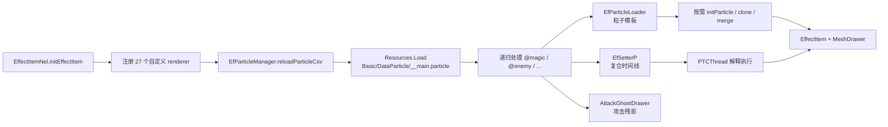

# Alice in Cradle ver029 粒子/特效系统分析与 API 设计

## 1. 范围与结论

分析目标为 `D:\AliceInCradle Win ver029 - BIE6\AliceInCradle_ver029`，主程序集与基础程序集由 `E:\dnSpy-net-win64\dnSpy.Console.exe` 反编译。目标版本使用 Unity `2022.3.62f2`、Mono 后端；本报告只针对 ver029，升级游戏后必须重新生成目录并做兼容检查。

最重要的结论：游戏画面特效的主体不是 Unity `ParticleSystem` 或 VFX Graph，而是一套自研系统：

1. `.particle` 文本定义底层粒子模板、复合播放时间线和攻击残影。
2. `PTCThread` 解释复合时间线，负责等待、条件、跟随、声音、震屏和派生子效果。
3. `EfParticle` 在每帧计算粒子位置、尺寸、颜色、旋转、插值曲线，并向 `MeshDrawer` 写入程序化网格。
4. `Effect<T>/EffectItem` 负责对象池、寿命、延迟、更新与 Mesh 批次。
5. 全屏后处理、角色染色/抖动、地图常驻效果另有独立系统，不能安全地简化成普通粒子。

在 `Assembly-CSharp.dll` 与 `unsafeAssem.dll` 的反编译代码中，没有发现 `ParticleSystem` 或 `VisualEffect` 调用。游戏虽然随包携带 `UnityEngine.ParticleSystemModule.dll` 与 `UnityEngine.VFXModule.dll`，但 ver029 的游戏逻辑没有使用它们。

## 2. 全量静态目录

从 `resources.assets` 中恢复出 24 个 `Resources/Basic/DataParticle/*.particle` TextAsset，共识别 2,083 个段：

| 种类 | 段数 | 唯一键数 | 作用 |
| --- | ---: | ---: | --- |
| `SETTER` 时间线 | 839 | 837 | 一次完整表现：粒子、程序化效果、声音、震屏、等待、条件与跟随 |
| 粒子模板 | 1,215 | 1,212 | 单个可重复生成的程序化粒子定义 |
| `AGD` 攻击残影 | 29 | 29 | 武器/肢体轨迹的带状网格与残影 |
| 合计 | 2,083 | 2,078 | 5 个键存在重复定义，加载时后定义覆盖前定义 |

逐键目录见：

- `catalog/AIC029-effect-assets.csv`：资产键、来源、行号、渲染类型、层、引用参数、指令、依赖和 `%EF` 调用。
- `catalog/AIC029-effect-code-usage.csv`：C# 中的字面量播放点与程序化 drawer。
- `catalog/AIC029-particle-renderer-types.csv`：注册的自定义粒子 renderer。
- `catalog/AIC029-effect-summary.json`：机器可读汇总。

目录脚本只保存元数据，不把游戏的完整粒子脚本文本复制进仓库。

### 2.1 按资源文件分布

| 文件 | 时间线 | 粒子 | AGD | 内容侧重 |
| --- | ---: | ---: | ---: | --- |
| `__main.particle` | 23 | 54 | 0 | 公共水花、脚步、UI/reel、炼金等共享模板；同时声明其他文件加载顺序 |
| `magic_basic.particle` | 0 | 19 | 0 | 魔法公共基础图元 |
| `magic.particle` | 67 | 192 | 0 | 火球、水晶、黑洞、炸弹、射线等魔法主体 |
| `damage.particle` | 23 | 44 | 0 | 受击、击倒、压伤、雷击等 |
| `mana.particle` | 4 | 8 | 0 | Mana 生成、吸收与飞行 |
| `enemy.particle` | 260 | 252 | 16 | 常规敌人行为、攻击、召唤、死亡及大量敌种专用表现 |
| `enemyod.particle` | 126 | 118 | 11 | OverDrive/大型敌人强化表现 |
| `enemy_attack_basic.particle` | 14 | 8 | 0 | 敌人攻击/吸收公共时间线 |
| `enemyattr.particle` | 10 | 14 | 0 | 火、冰、雷等属性附着 |
| `attack.particle` | 35 | 66 | 2 | 玩家近战、盾、轮、闪避和命中特效 |
| `attack_alice.particle` | 7 | 14 | 0 | Shine Booster 等 Alice 专属表现 |
| `ui.particle` | 53 | 91 | 0 | 菜单、状态、提示、肖像和 UI 动画 |
| `lp.particle` | 48 | 67 | 0 | 地图 LabelPoint、机关、篝火、门、落石等 |
| `ser.particle` | 35 | 34 | 0 | 状态效果 |
| `puzzle.particle` | 40 | 72 | 0 | 谜题开关、屏障、装置 |
| `item.particle` | 14 | 39 | 0 | 道具获得、使用、宝箱等 |
| `ep.particle` | 5 | 8 | 0 | 特殊状态/演出 |
| `ev.particle` | 39 | 30 | 0 | 事件与剧情演出 |
| `weather.particle` | 7 | 6 | 0 | 风、天气环境 |
| `fatal.particle` | 3 | 39 | 0 | Fatal 演出专用 |
| `mgm_dojo.particle` | 8 | 22 | 0 | Dojo 小游戏 |
| `ui_mgm_farm.particle` | 7 | 9 | 0 | Farm 小游戏 UI |
| `mgm_fish.particle` | 9 | 8 | 0 | Fishing 小游戏 |
| `debug.particle` | 2 | 1 | 0 | 调试表现 |

## 3. 资源加载与初始化

入口链如下：

`EfParticleManager` 的固定配置为：

- 资源目录：`Basic/DataParticle/`
- 主文件：`__main`
- 扩展名：`.particle`
- `@name`：递归加载另一份 `.particle`
- `%CLONE`：先复制基模板/时间线，再覆盖本段字段
- `%MERGE`：把另一段内容合并进当前段

`__main.particle` 的加载顺序固定为 `magic_basic → magic → damage → mana → enemy → enemyod → ... → debug`。相同键后定义覆盖前定义，因此顺序本身是行为的一部分。

## 4. 三层核心模型

### 4.1 `SETTER`：复合时间线

`/* ___ SETTER.key ___ */` 定义可由 `PtcST("key")` 播放的时间线。它不是单粒子，而是一个轻量脚本：

- 变量与表达式：`&cx`、`&cy`、`&agR`、随机数、条件、局部赋值。
- 时序：`%WAIT`、`WAIT`、`%LOOP`、跳转与嵌套 setter。
- 位置：`%MYPOS`、`%TARGETPOS`、`%SIZE`、`%FOLLOW`。
- 表现：普通行表示粒子键，`%EF` 表示程序化 `EffectItem`，`%AGD` 表示攻击残影。
- 反馈：`%SND`、`%PVIB`、`%QU_VIB/%QU_SINH/%QU_SINV` 等。
- 游戏对象可通过 `IEfPInteractale.readPtcScript` 扩展 DSL，因此敌人/玩家专用命令不全在 `PTCThread` 本体里。

静态目录中最常见的指令是 `%CLONE` 656 段、`%SND` 524 段、`%WAIT` 327 段、`%MERGE` 117 段、震屏/震动相关指令约 300 段。它说明一次“特效”常常同时编排视觉、音频与镜头反馈。

调用路径为：

`M2Attackable/MagicItem/Map2d.PtcST → PtcHolder（可选）→ Effect.PtcST → PTCThreadRunner.makeST → PTCThread.run`。

`PTCThread` 创建的子效果可在键前加 `*`，此时子 `EffectItem` 被线程 stock；停止线程时可以选择只停 reader，或连 stock 子效果一起停止。

### 4.2 `EfParticle`：单粒子模板

`/* ___ key ___ */` 定义一个模板。关键字段包括：

- 发射：`count`、`maxt`、`delay`、循环时间。
- 初始分布：`xdf/ydf/zdf`、正反向概率、序号偏移。
- 轨迹：`slen`、方向、移动距离、Bezier、重力与反弹。
- 外观：`zm`、`thick`、旋转、透明度、颜色起止与插值函数。
- Mesh 变换：纵向缩放、旋转、平移。
- 渲染：`type`、`layer`、gradation、材质/混合。
- 优化：相机包围范围、粒子数量/速度质量缩放。

内置 `PtTYPE` 有 35 种：点、线、圆、位图、序列图、星形、菱形、弧、电线、电弧、光环、模糊圆/多边形、冲击波、风、门线等。游戏另注册 27 个 renderer，例如 `SMOKE(_L)`、`WATER_SPLASH`、`PARTICLE_SPLASH(_F)`、`LEAF`、`KISS`、`HEART`、`BUBBLE_*`、`FRAMERIPPLE`、`SHOCKWAVE_PIC`。

模板最终不创建大量 GameObject。`EfParticle.FD_EfRun` 每帧遍历逻辑粒子，把顶点写进当前 `MeshDrawer`；`EffectMeshManager` 按 key、材质、top/bottom 分组复用 Mesh。主要渲染类型使用量为：

- `CIRCLE` 94、`BLURCIRCLE` 75、`SMOKE_L` 51、`HALO` 49。
- `POLYGON` 44、`LINE` 38、`DOORLINE` 31。
- 644 段没有显式 `type`，主要通过 `%CLONE/%MERGE` 继承。

### 4.3 `AGD`：攻击残影

`/* ___ AGD.key ___ */` 由 `AttackGhostDrawer` 解析，用于刀光、拳击、触手和大型敌人攻击轨迹。它和粒子不同：输入通常是动作前后采样点/骨骼点，输出是连续带状或分段残影。24 份资源中共有 29 个 AGD，主要集中在 `enemy.particle`、`enemyod.particle` 与 `attack.particle`。

## 5. 运行容器、坐标和生命周期

### 5.1 Effect 容器

主地图初始化两个 `EffectNel`：

- `EF`：上限 512，Dungeon effect camera，世界普通/底层特效，top Z=120、bottom Z=420。
- `EFT`：上限 80，final camera，最终合成/顶层特效，top Z=26、bottom Z=45。

地图 chip 使用 `EffectNelMapChip`，UI 肖像使用 `EffectUIPicture`，PostEffect 自己也是 `Effect<PostEffectItem>`。`Effect.setE/PtcN` 达到上限时返回 `null`，因此 API 必须把“播放失败”建模为正常结果，而不是假设一定成功。

### 5.2 坐标

世界特效的输入是 map 坐标。`EffectNel.calcMeshXY` 经 `Map2d.map2u*` 与 camera 变换得到 effect screen 坐标；没有 map 时按 `CLEN * 1/64` 比例转换。UI/final camera 容器使用另一套直接坐标。API 因而显式区分 `EffectSpace` 和 `EffectTargetLayer`，不能只传一个裸 `Vector2`。

### 5.3 延迟与起播年龄

`EffectItem.clear` 对 `saf` 的解释容易踩坑：

- `saf >= 0`：延迟这么多帧才真正执行。
- `saf < 0`：立即开始，但把 age 预推进 `-saf` 帧。

API 将二者拆成互斥的 `WithDelay` 与 `WithStartAge`，避免“负延迟”这种难读约定。

### 5.4 跟随与持有

跟随模式有 `CENTER/TOP/HIP/HEAD/SOURCE/DESTINATION/MAGICCIRCLE`。`PtcHolder` 还管理持有位：普通、动作、混乱状态和 `_NO_KILL`。角色换动作、状态结束、对象销毁时可按持有位批量杀掉时间线、stock 子效果及循环声音。

`PtcHolder` 同时把慢动作系数交给 `PostEffect.addTimeFixedEffect`，保证画面、粒子与动作时间缩放一致。

## 6. 其他表现系统

### 6.1 程序化 `EffectItem`

`EffectItem.initEffect` 按 `fnRunDraw_{title}` 反射绑定静态 drawer；也可由 `setEffectWithSpecificFn` 直接传 delegate。`EffectItemNel` 内有 53 个命名 drawer，包括 flash/iris、召唤、爆炸球、afterimage、盾、状态 UI 等。另有 41 个 `setEffectWithSpecificFn` 字面量调用点，用于 boss 网、黑洞、cut-in、计时器、目标圈等对象私有 drawer。

这类效果往往直接画复杂 Mesh 或访问玩法对象，不能由 `.particle` 完整描述。

### 6.2 全屏 `PostEffect`

`PostEffect` 有 32 个 `POSTM` 槽，分为三类：

- `PEMaterial`：HP/MP 减少、flash、jamming、gas、worm trapped、stone、iris、whole ripple 等全屏材质。
- `PESpecial`：时间缩放、镜头 zoom/confuse、雨强度、BGM 低通/水下、音量压低、最终画面 alpha。
- `PEInterrupt`：在 camera render pipeline 中插入 bloom。

它提供 basic、bounce、bounce2、absorbed、fade-in/out 等不同包络，并按 `MINMAX/ADD/SCREEN` 规则聚合多个来源。代码中发现 113 个显式 `setPE*` 调用，最常用的是 `ZOOM2`、`FINAL_ALPHA`、`SHOTGUN`、`GAS_APPLIED`、`JAMMING`。

### 6.3 对象级 `TransEffecter`

`TransEffecter` 注册 Transform、SpriteRenderer、MeshDrawer 或自定义接口，然后叠加 38 类 `TEKIND` drawer：

- 位置：随机 quake、水平/垂直正弦震动、shift fadeout。
- 颜色：受击闪烁、附加色、毒气色、fade in/out、事件压暗。
- 缩放：bounce、吸收形变、出现/消失、压缩、气泡形变。

它按 kind 分组去重，并在一帧结束时统一合成位置、颜色、缩放。它不是粒子，也不是屏幕后处理。

### 6.4 地图常驻/特殊系统

- `M2DrawBinderContainer`：把长驻绘制 delegate 挂到地图/相机更新，用于机关、地图 chip 与环境表现。
- `EfParticleLooper/EfParticleOnce`：把粒子直接画入调用方 Mesh，适合篝火、地图机关、预览和无需独立 `EffectItem` 的循环表现。
- `M2WaterEffect/WaterEffectItem`：水面命中、波纹、飞溅等专门对象池。
- `RainEffector`：缓存相机范围内碰撞线，维护最多 24 个雨滴命中，另画雨线。
- `DarkSpotEffect`：按 mover 与 spot 管理局部暗区，并联动 PostEffect。
- `M2SinkEffect`：水下/下沉状态、循环音与后处理的组合控制器。
- `BonfireEffector/M2LpParticleDrawer`：通过 looper 与 draw binder 画常驻地图粒子。
- `M2DropObjectReader`：血、蛋、液体等带简化物理的 drop effect 使用独立 draw callback。
- PixelLiner/Spine 序列是许多自定义 renderer 的图片/动画来源，但不负责发射和生命周期。

## 7. 抽象 API

具体实现已整理为 [PolarisParticles 特效数据分离 API 实现方案](../design/PolarisParticles-特效数据分离API方案.md)。`.peffect` 直接使用原版 `.particle` 内容格式，由兼容层接入 `EfParticleManager` 原生加载流程，不建立另一套 Definition 或粒子格式。

新方案的公开契约统一为：

- `PolarisParticlesAPI.Effects`：唯一静态入口，返回 `EffectAPI`。
- `EffectFileAPI`：登记内嵌 `.peffect` 文件并建立虚拟文件目录。
- `EffectPlayRequest`：时间线的 anchor、空间、层、跟随、参数与 owner。
- `ParticleSpawnRequest`：单粒子的坐标、层、寿命、延迟和起播年龄。
- `EffectRuntime`：包装本次原版 `PTCThread` 或 `EffectItem`。
- `EffectScope`：一次施法或阶段拥有的 Runtime 集合，退出阶段统一清理。
- 兼容层：注入原版加载流程并隔离 ver029 类型。

示例：

~~~csharp
using EffectScope fx = PolarisParticlesAPI.Effects.BeginScope(owner: Context.Self);

EffectRuntime charge = fx.PlayTimeline(
    "mymod_fireball_prepare",
    EffectPlayRequest.At(Context.Self.Position)
        .Follow(Context.Caster, EffectFollowPoint.MagicCircle)
        .Set("angle", angle)
        .Set("facing", facingRight ? 1 : -1)
        .Set("color", 0xFF66CCFF));

charge.Stop(EffectStopMode.IncludeSpawnedEffects);
~~~

### 7.1 原生 backend 映射

建议 backend 放在有权引用游戏程序集的兼容层（PolarisCore/PolarisBasic），不要放回作者层：

| API kind | ver029 映射 | backend token |
| --- | --- | --- |
| `.peffect` 加载 | 虚拟 `getParticleScript` + `reloadParticleCsv` | `OPtc/OPtcSetter/OAgd` |
| `PlayTimeline` | `IEffectSetter.PtcST(key, listener, follow, VariableP)` | `PTCThread` |
| `SpawnParticle` | `IEffectSetter.PtcN(key, x, y, z, time, saf)` | `EffectItem` |
| 程序化扩展 | `IEffectSetter.setE(key, x, y, z, time, saf)`，必须 allowlist | `EffectItem` |
| 后处理扩展 | `PostEffect.setPE/setPEbounce/...` + `POSTM` | `PostEffectItem` |

backend 的关键规则：

1. Timeline 参数应创建本次请求专属 `VariableP` 并传入 `PtcST`，不要走静态 `PTCThreadRunner.PreVar`。
2. `TimelineOnly` 映射 `PTCThread.kill(true)`；`IncludeSpawnedEffects` 映射 `kill(false)`。
3. 动态 anchor 若能解析到原生 `IEfPInteractale`，使用原生骨骼跟随；否则只能采样中心坐标，不能谎称支持 head/hip/magic-circle。
4. `EffectTargetLayer.WorldTop` 选择 `Map2d.getEffectTop()`；普通世界层选择 `Map2d.getEffect()`。
5. 查询必须区分 setter、particle、AGD、programmatic drawer 与 POSTM，不能用一个字符串字典混查。
6. `TryPlay` 要把容器满、地图未加载、键不存在和 anchor 失效视为可恢复失败。

## 8. 已发现的风险与异常

1. `PTCThreadRunner.PreP` 是静态变量容器；成功创建线程后没有统一清空。原版代码通常依赖下一次覆盖同名变量，但第三方若少写一个参数可能继承上一次值。新 API 通过 per-request `VariableP` 隔离。
2. `EfParticle` 使用大量静态 scratch 字段（`Md/cx/cy/tz/ran/...`），只能在游戏主线程、非重入地绘制。
3. 有 5 个重复键：`cp_alchemy_pot_light`、`fatal_breathe`、`ui_absorb_darken`、`mimic_ironball_init_grawl`、`webshot_appear`。首次加载时后定义覆盖前定义；可能是有意 override，也可能是遗留资产。
4. `magic.particle` 的 `hit_en_itembomb_mag_halo` 写了 `type TOP_ADD`；`TOP_ADD` 实际是 `EFLAY`，不是 `PtTYPE`。因为该段 clone 了已有模板，renderer 会保留继承值，但 top layer 没有被正确设置，疑似资产笔误。
5. `PostEffect` 构造 `AMtr[POSTM.SEPIA]` 时传入的内部 type 是 `POSTM.STONEOVER`。数组槽仍可工作，但内部标识/诊断可能错误，升级兼容层时应做行为测试。
6. programmatic drawer 依赖反射命名 `fnRunDraw_{key}`。混淆、改名或版本新增参数都会造成运行时找不到效果；backend 应启动时预检 allowlist。
7. 主 `EF`、顶层 `EFT` 都有硬上限，粒子数还受 `X.EF_LEVEL_NORMAL/UI` 质量设置裁剪。视觉测试不应假设固定粒子数量。

## 9. 验证与下一步

当前完成的是全资源静态覆盖、API 契约设计和原生 backend 落地方法；仓库不包含 API 的 C# 实现。自行实现 backend 并接入 native assembly 后，还应在实际游戏内做以下动态验证：

1. 启动后枚举 `EfParticleManager` 三张字典，与 CSV 目录比较。
2. 每类 renderer 至少播放一个代表效果，验证世界、顶层、UI 三套坐标。
3. 验证动态 follow 的 center/head/hip/magic-circle。
4. 验证 scope 停止是否同时停止 stock 粒子和循环音。
5. 验证 PostEffect 的聚合、抑制和地图切换清理。
6. 对 ver029 升级后的程序集/资源运行同一目录脚本，以键差异和方法签名差异作为兼容门禁。
